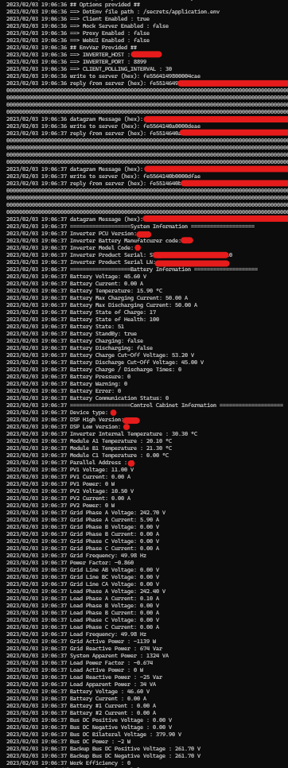

# Sermatec Inverter Proxy

**Not production ready**

The aim of this project is to proxify the Sermatec inverter to enable multiple connection to it.
The reverse engineering of the Sermatec inverter communication protocol is based on these projects :
 - [Sermatec Inverter Python Lib](https://github.com/sermatec-opensource/sermatec-inverter)
 - [Sermatec Protocol extraction](https://github.com/sbechet/sermatec-ess)

Thanks to :
 * [Ondřej Golasowski](https://github.com/andreondra)
 * [Sebastien Bechet](https://github.com/sbechet)

There is few modes for running this application :
 * The client only mode: will enquire the inverter and log the information received on the StdOut
 * The proxy mode: Polling on a regular basis the inverter to get the data, and open few ports using the same protocol than inverter for other usage, and connection pool creation.
 * The mock server mode: creating a server which will answer a bunch of predefined answers, for working on the protocol client without having an inverter at disposal.

## Technology involved in the project
 * Golang
 * Docker
 * React JS

## Usage

There is no build for this application right now, needs **docker** to run.
It builds and run the command on the fly.
There is a makefile that provide you easier access to different running modes.

#### Generating env file
Necessary to generate the first application.private.env file, see below.
```bash
make generate_env_file
```

#### Build the application
Useful only if you want to test the building process (dev purpose).
```bash
make build
```

#### Showing command line help
Self-explanatory
```bash
make help
```

#### Running the binary in client only mode
This mode will poll the inverter on a regular basis (**CLIENT_POLLING_INTERVAL**) and display data retrieved on the console output.
```bash
make run-client-only
```


### Binary Command line arguments

| argument                       | description                                           | optional / required | 
|--------------------------------|-------------------------------------------------------|---------------------|
| `-dot-env-file <path/to/file>` | load the dotenv file                                  | optional            |
| `-client`                      | enable the client to inverter                         | optional            |
| `-mock-server`                 | enable the mock server (imply no client and no proxy) | optional            |
| `-proxy`                       | enable the proxy server (imply client enabled)        | optional            |
| `-ui`                          | enable the webui server                               | optional            |
| `-h`                           | show this help                                        | optional            |

### DotEnv file

The env file is generating at each run, concatenating `./application.example.env` with `./application.private.env` into a `./application.env`.
 * `./application.example.env` => provided in the repository with fake example data.
 * `./application.private.env` => created if not exists at first run using `make generate_env_file` recipes, excluded from commit, place here your specific setup (ip, polling interval, etc...).
 * `./application.env` => generated at each run, don't override data here, it will be useless, this env file is provided to application binary through docker-compose services.

```env
INVERTER_HOST=<INVERTER IP OT HOST>
INVERTER_PORT=<INVERTER PORT USUALLY 8899>
CLIENT_POLLING_INTERVAL=<NUMBER OF SECONDS BETWEEN INVERTER POLL>
```

*Note: try to not poll too often the inverter, it has low limits... 15s or 30s are quite enough*
